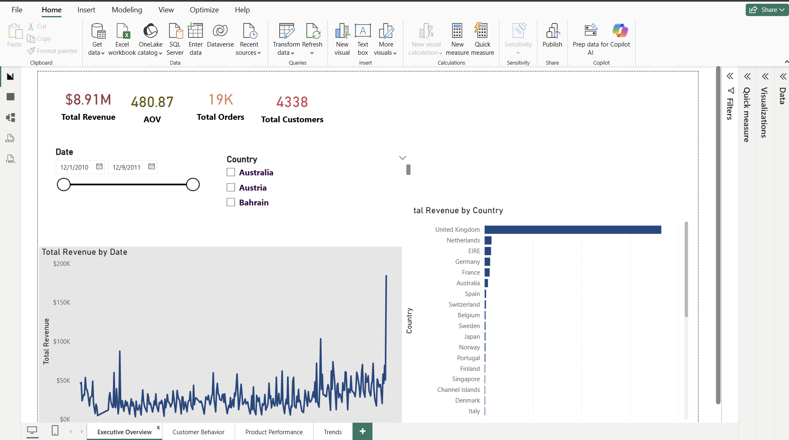
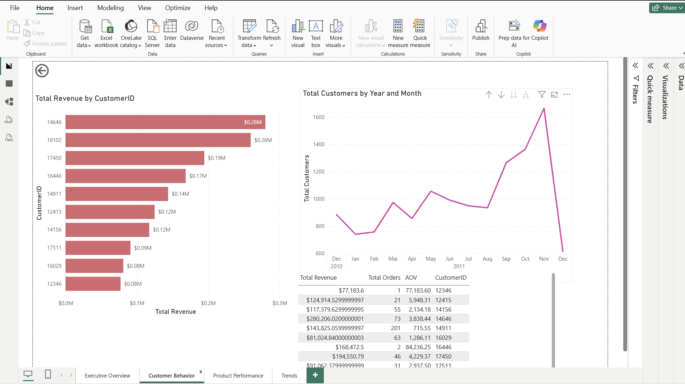
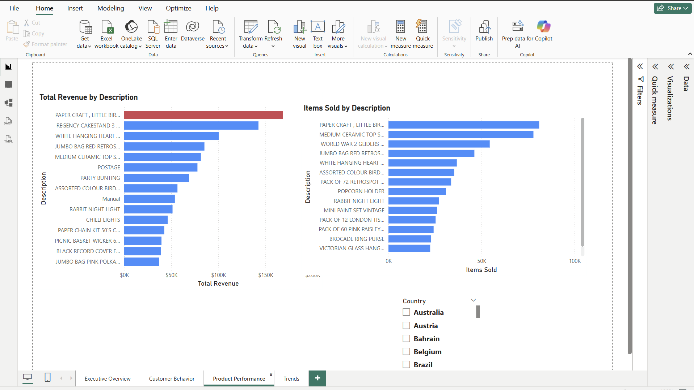
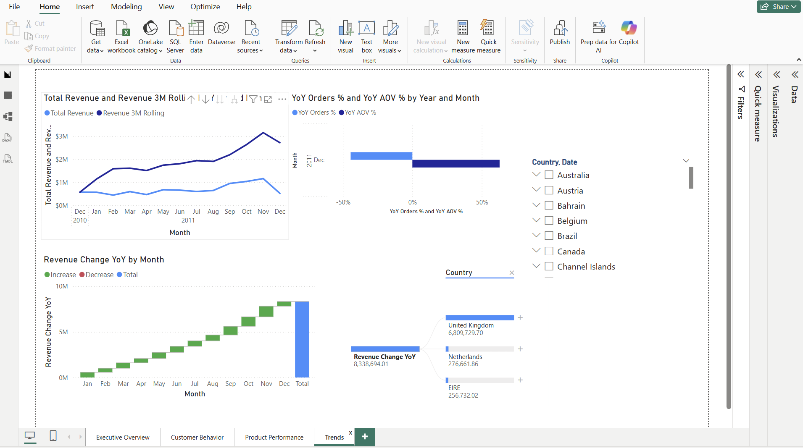

# Sales Performance Dashboard (Power BI)

## Overview
This project is a Power BI sales analytics dashboard built using a public retail transactions dataset. It demonstrates data cleaning in Power Query, KPI creation in DAX, time-based trend analysis, and multi-page dashboard design.

## Business Goal
The dashboard is designed to answer the following:
- What is the total revenue, total orders, total customers, and average order value (AOV)?
- How is revenue trending over time?
- Which customers contribute the most revenue?
- Which products drive revenue and volume?
- How is performance changing month-over-month and year-over-year?

## Dataset
This project uses a public retail transactions dataset (Online Retail / Online Retail II).

For dataset details and cleaning assumptions, see:  
`Data/data_source.md`

## Data Preparation
The raw data was cleaned in Power Query by:
- Removing cancellation transactions (`InvoiceNo` starting with "C")
- Filtering `Quantity > 0`
- Filtering `UnitPrice > 0`
- Removing rows with null `CustomerID` (for customer analysis)
- Creating a new `Revenue` column = `Quantity * UnitPrice`

Detailed steps:  
`Powerbi/power-query-steps.md`

## Data Model
A Date table was created to support time intelligence calculations such as MoM% and YoY%.

For model notes, see:  
`Powerbi/model-notes.md`

## DAX Measures
The following KPIs were created using DAX:
- Total Revenue
- Total Orders
- Total Customers
- Items Sold
- AOV
- Revenue PM
- Revenue LY
- MoM Revenue %
- YoY Revenue %

Full DAX list:  
`Powerbi/dax_measures.md`

## Dashboard Pages

### Page 1 — Executive Overview
- KPI cards for Revenue, Orders, Customers, AOV
- Revenue trend by month
- Revenue by country

### Page 2 — Customer Behavior
- Top 10 customers by revenue
- Customer trend by month
- Top 20 customer table with Revenue, Orders, and AOV

### Page 3 — Product Performance
- Top 10 products by revenue
- Top 10 products by items sold

### Page 4 — Trends
- MoM Revenue %
- YoY Revenue %
- Rolling 3-month Revenue (optional)

## Screenshots

## SQL Validation
Basic SQL KPI validation queries are included here:  
`SQL/kpi_queries.sql`

## Project Structure
- `Data/` → dataset notes and assumptions
- `Powerbi/` → DAX, Power Query steps, model notes
- `SQL/` → KPI validation queries
- `assets/screenshots/` → dashboard screenshots
